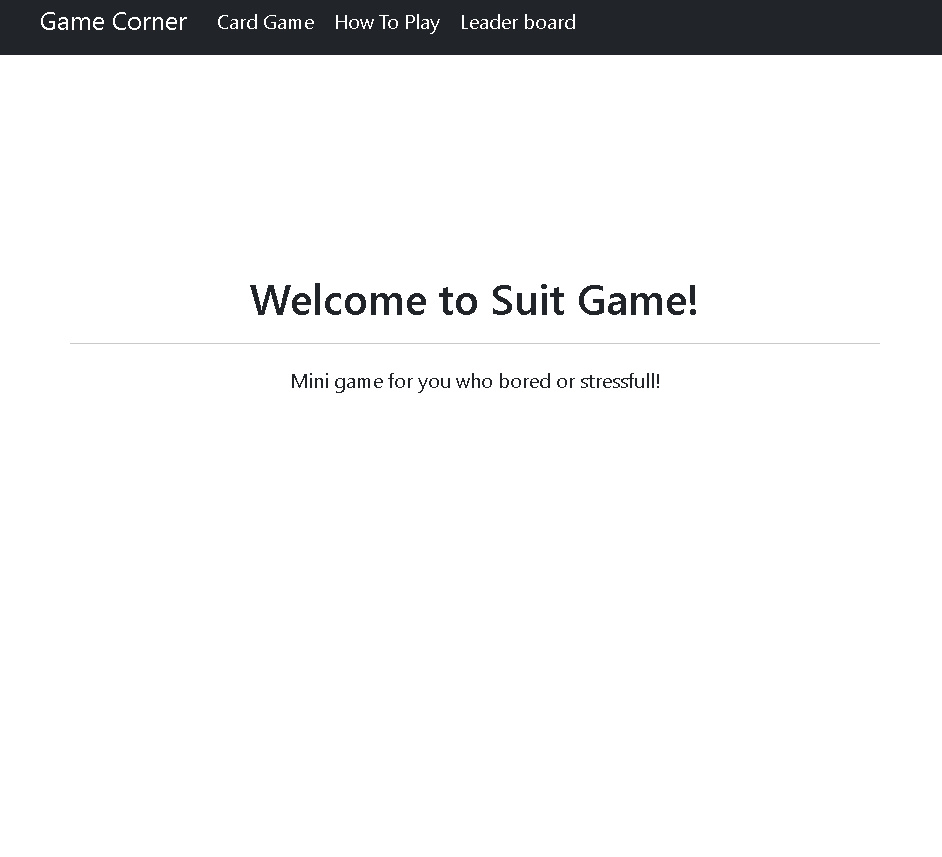
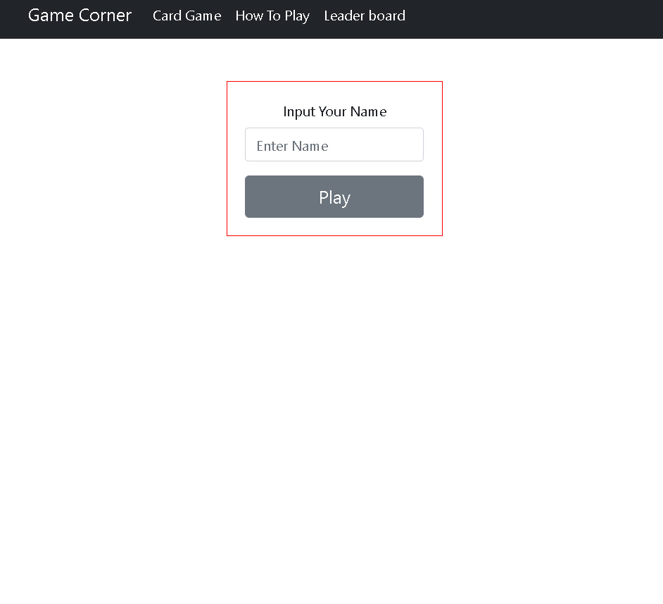
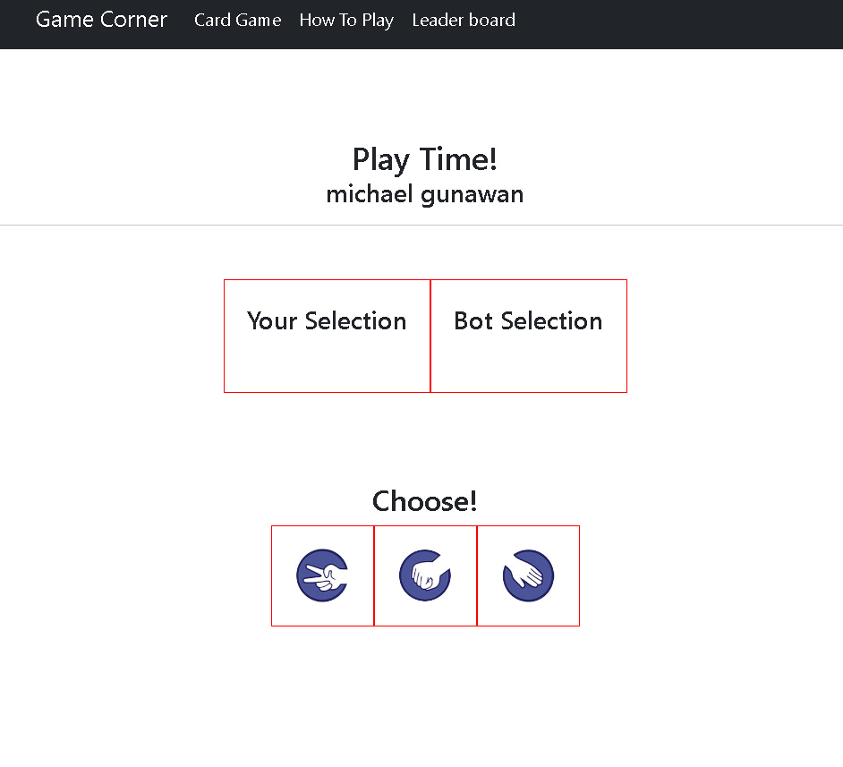
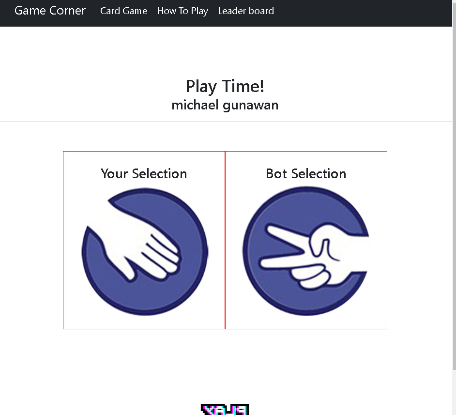
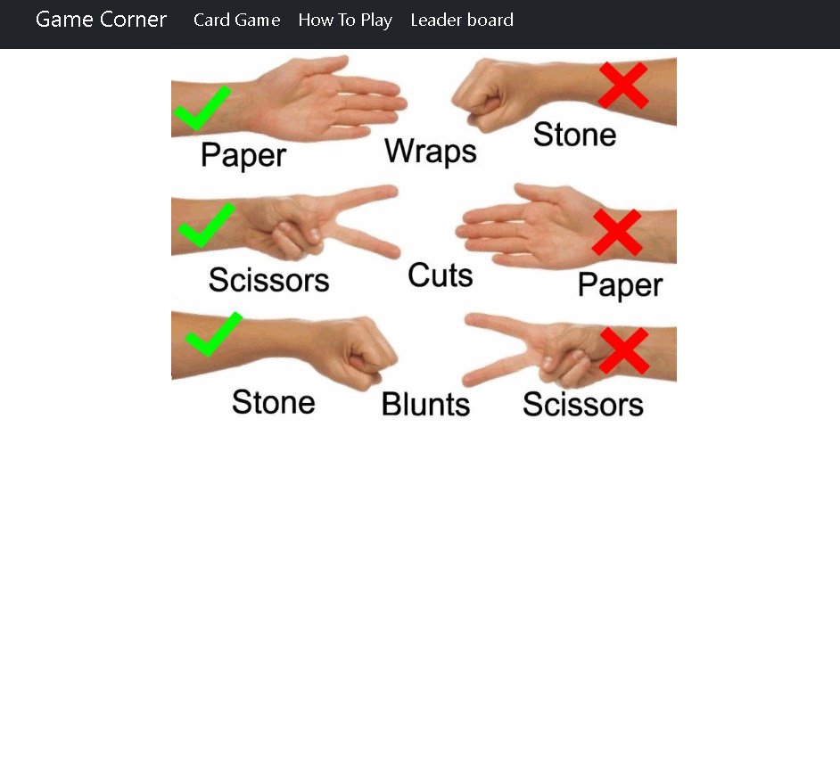
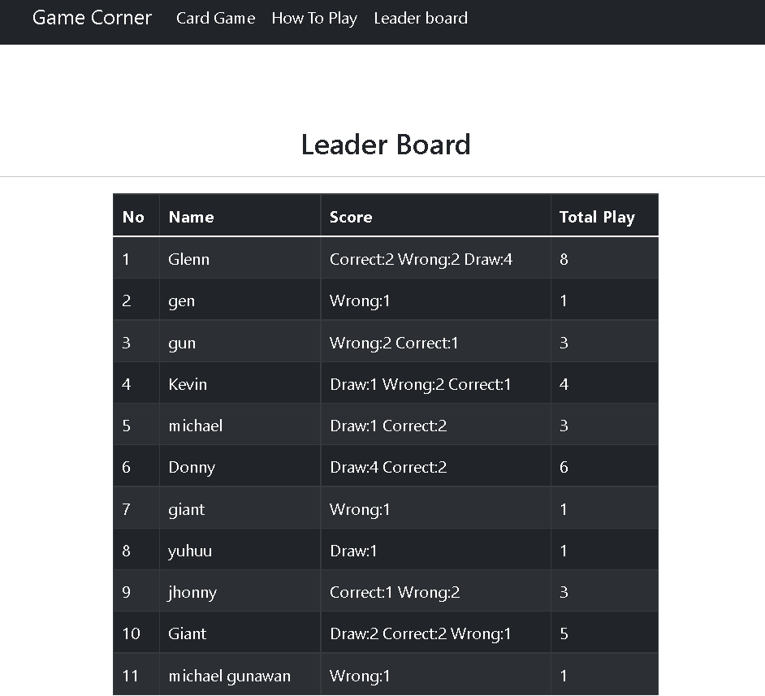

# Suit Game By MG

> This project backend deployed using heroku URL:[https://github.com/Mglenn23/backend-phase2-project](https://github.com/Mglenn23/backend-phase2-project)

Suit game front end created using react, bootstrap, css. backend using heroku for deployment db.json. To play this game, the player needs to choose paper/rock/scissors. Bot will random choose paper/rock/scissors. How to win this game, every time choose the same with bot will draw and scissors > paper > rock > scissors. The game will be displayed leaderboard off the player and count draw,correct,wrong & total play.

## Table of Contents

- [Available Scripts](#available-scripts)
- [General Info](#general-information)
- [Tools Used](#tools-used)
- [Features](#features)
- [Screenshots](#screenshots)
- [Room for Improvement](#room-for-improvement)
- [Acknowledgements](#acknowledgements)
- [Contact](#contact)

## Available Scripts

In the project directory, you can run:

### `npm start`

Runs the app in the development mode.\
Open [http://localhost:3000](http://localhost:3000) to view it in your browser.

## General Information

- Deployed db.json in heroku
- One page load without refresh the page, using react-router
- Create react app using npx create-react-app
- Simple design website with interactive game play with bot

## Tools Used

- Bootstrap - https://react-bootstrap.github.io/
- Sweetalert2 - https://sweetalert2.github.io/recipe-gallery/sweetalert2-react.html

## Features

List the ready features here:

- Play with bot
- Players leaderboard(how many correct, wrong, draw & play time)

## Screenshots

## Room for Improvement

There is a plan for improvement with this project, to make this game more interactive.

Room for improvement:

- Improvement to be done animation and design more interactive
- Improvement to be done add another game mode

To do:

- Feature to be added mode player 1 vs player 2

## Acknowledgements

- This project was inspired by my childhood called suit game played with my friends.
- Many thanks to my Flatiron school lectures
- This is my phase2 project at Flatiron school

## Contact

Created by [@mg](https://www.linkedin.com/in/michael-gunawan-030a52194/) - feel free to contact me!
